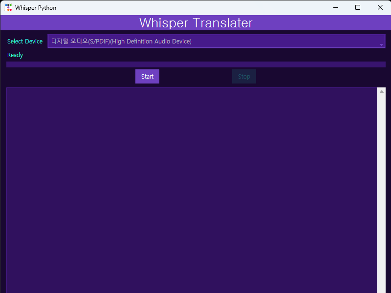

# Whisper Translator

Realtime English to Korean translater using openai's [whisper](https://github.com/openai/whisper) and Google's cloud API

# Requirements

You need to register to Google cloud API service. Google allow trial subscription and give enough credit to test their APIs.

Create API key and download created key file (.json).
Create an envirionment variable 'GOOGLE_APPLICATION_CREDENTIALS' and make it direct to the location of the key file you downloaded.

# Packages

- whisper
- torch
- numpy
- soundcard
- webrtcvad
- tkinter
- ttkbootstrap

# Run the app

`python whisperapp.py`

Select the device you want to capture the audio and press 'Start' button.

Then the app will listen to the PC's audio output and automatically transcribe and translate English speaking to Korean.

# Limitations

The app struggles when the speaker mumbles a lot or speaks too fast non-stop or there is background music going on.

# Other languages

If you want to change the target language, find line calling 'translate_text' method and change 'ko' to the language code you want.

